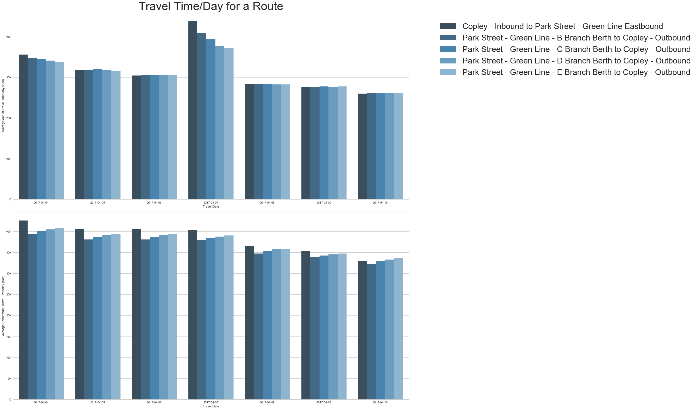

# MBTA Subway - TYSON (daTa analYsis and viSualizatiON)

- This project is about performing various data related tasks in Python. 
- MBTA Subway data is collected and stored using MBTA Real-time API and this data is used for several analysis and visualizations. 
- MBTA-realtime provides RESTful web services to provide data about MBTA services. 
- Data is collected in JSON and CSV format.

## Getting Started:


- This view is created in bokeh for MBTA Subway routes on the Map of Boston. 
- Shape files from [Boston Shape File](https://data.cityofboston.gov/City-Services/Boston-Neighborhood-Shapefiles/af56-j7tb) and [MBTA Routes - Points and Lines](http://www.mass.gov/anf/research-and-tech/it-serv-and-support/application-serv/office-of-geographic-information-massgis/datalayers/mbta.html) is collected
- In this project, MBTA Subway's Schedules, Alerts and Travel time is majorly used to perform analysis and visualization.
- To request a data one must need to register on [MBTA realtime Portal](http://realtime.mbta.com/Portal/) and request a API
- Using provided key, data like Routes, Stops, Schedules, Alerts, Travel time, Dwell time can be collected and used.

## Prerequisite:

#### Below libraries were used for Python 3.6 (Please refer Dependencies for below libraries)
1. NetworkX
2. Bokeh
3. Bokeh NodeJs
4. Jvascript Gulp
5. Geopy
6. Geopandas
7. Pysal
8. Pydotplus
9. Graphviz
10. Fiona

## Data Collection and Storage:

#### 1. Route: Provide all the Routes
| ** Input **| ** Output **| 
|:-----------:|:------------:|
|API Key|Parameters like Mode, Route_Type, Mode_Name, Route, Route_ID, Route-Name is generated|

#### 2. Stop:  Provide all the Stops served by a route
| ** Input **| ** Output **| 
|:-----------:|:------------:|
|API Key, Route Name (Ex: Red)|Parameters like Route_ID, Route-Name, Direction_ID, Direction_Name, Stop, Stop_Order,stop_id, stop_name, parent_station, parent_station_name, stop_lat, stop_lon is generated|

#### 3. Schedule: Provide all the scheduled arrivals and departures in a direction for a particular route 
| ** Input **|** Output **| 
|:-----------:|:------------:|
|API Key, Route Name (Ex: Red)|Parameters like Mode, Route_Type, Mode_Name, Route_ID, Route-Name, Direction_ID, Direction_Name,Trip_ID, Trip_Name,Stop_Sequence, Stop, stop_id, stop_name, sc_arr_date, sc_dep_date is generated|

- ** Note: By default data is generated for current date and schedules within one hour of time **

#### 4. Alerts By Route:  Provide information about service disruptions and changes – current and upcoming, planned and unplanned for a particular route
| ** Input **| ** Output **| 
|:-----------:|:------------:|
|API Key, Route Name (Ex: Red)|Parameters like Route_ID, Route-Name,Alert_ID, Alert_Name,effect_name, effect, cause_name, cause, header_text, short_header_text, url, description_text, severity, created_dt, last_modified_dt, , service_effect_text, timeframe_text, effect_periods, , effect_start, effect_end, affected_services, services, elevators, route_type, mode_name, Direction_ID, Direction_Name,Trip_ID, Trip_Name,Stop_Sequence, Stop_id, stop_name is generated|

- ** Note: Here data is generated for route, because of which services are affected **

#### 5. Alerts By Stop:  Provide information about service disruptions and changes – current and upcoming, planned and unplanned for a particular stop
| ** Input **| ** Output **| 
|:-----------:|:------------:|
|API Key, Stop_IDs (Ex: plc_ale - Alewife)|Parameters like Route_ID, Route-Name,Alert_ID, Alert_Name,effect_name, effect, cause_name, cause, header_text, short_header_text, url, description_text, severity, created_dt, last_modified_dt, , service_effect_text, timeframe_text, effect_periods, , effect_start, effect_end, affected_services, services, elevators, route_type, mode_name, Direction_ID, Direction_Name,Trip_ID, Trip_Name,Stop_Sequence, Stop_id, stop_name is generated|

- ** Note : Here, data is generated for stops, because of which services are affected **
- ** Input Stop_IDs are referred from GTFS data available on MBTA real time portal **

#### 6. Predictions: Provide the predictions for upcoming trips (including trips already underway) in a direction for a particular route or routes
| ** Input **| ** Output **| 
|:-----------:|:------------:|
|API Key, Route Name (Ex: Red)|Parameters like Mode, Route_Type, Mode_Name, Route_ID, Route-Name, Direction_ID, Direction_Name,Trip_ID, Trip_Name,vehicle, VEhicle_ID, Vehicle_lat,Vehicle_lon, vehicle_bearing, vehicle_speed, vehicle_timestamp, Stop_Sequence, Stop, stop_id, stop_name, sc_arr_date (Arrival Datetime), sc_dep_date (Departure Datetime), pre_dt (Prediction datetime), alert_id, header_text, effect_name is generated|

#### 7. Vehicles: Provide the vehicle positions for upcoming trips (including trips already underway) in a direction for a particular route or routes
| ** Input **| ** Output **| 
|:-----------:|:------------:|
|API Key, Route Name (Ex: Red)|Parameters like Mode, Route_Type, Mode_Name, Route_ID, Route-Name, Direction_ID, Direction_Name,Trip_ID, Trip_Name,vehicle, Vehicle_ID, Vehicle_lat,Vehicle_lon, vehicle_bearing, vehicle_speed, vehicle_timestamp is generated|

#### 8. Travel Time: Provide a list of travel times as well as benchmark travel times between an origin-destination (O-D) pair during the time period defined in the call
| ** Input **|** Output **| 
|:-----------:|:------------:|
|API Key, From Stop ID and To Stop ID, Datetime pair|Parameters like Route_ID, Route-Name, Direction_ID, Dep_dt (Departure Datetime),Arr_dt (Arrival Datetime), travel_time_sec, benchmark_travel_time_sec, threshold_flag_1, threshold_flag_2, threshold_flag_3 is generated|

- ** Note: From Stop ID and To Stop ID are referred from GTFS data available on MBTA real time portal **

#### 9. Dwell Time: Provide a list of dwell times at a stop during the time period defined in the call
| ** Input **| ** Output **| 
|:-----------:|:------------:|
|API Key, Stop_IDs (Ex: plc_ale - Alewife), Datetime pair|Parameters like Route_ID, Route-Name, Direction_ID, Dep_dt (Departure Datetime),Arr_dt (Arrival Datetime), dwell_time_sec is generated|

- ** Note: Input Stop_IDs are referred from GTFS data available on MBTA real time portal **

## Analysis and Visualization:

### 1. Schedule Analysis and Visualization: (Major Libraries Pandas, NLTK, Seaborn, Geopy, Bokeh)
   
   ** A. Analyze the number of trips by route and by date and visualize such that number of trips can be seen highest to lowest: **
   - Schedule data was read from .csv and then converted to dataframe.
   - Various operations of Pandas were applied to generate required data like
       - Epoch Datetime was converted to Date
       - Data was grouped by route name and date by doing this number of trips on particular date for particular route id counted
       - Pivot of Dataframe was generated
   - By using pivoted data, Heatmap in seaborn is generated
   
    ** B. Analyze the number of trips by stop and by date and visualize such that number of trips can be seen highest to lowest: **
   - Schedule data was read from .csv and then converted to dataframe.
   - Various operations of Pandas were applied to generate required data like,
       - Epoch Datetime was converted to Date
       - Data was grouped by stop name and date by doing this number of trips on particular date for particular stop id counted
       - Rate of the trip was calculated by finding total trips and diving number of trips to total
       - Pivot of Dataframe was generated
   - By using pivoted data, Heatmap in seaborn is generated
   
   
   ** C. Finding the synset of all the stops: **
   - Synset of stops means finding all the possibilities like highway, city, state, country, railway, object name in the world and matching to the name of the MBTA Subway stop names
   - Nomatin in Geopy was used to find all the posible modes matching to the name of the stop
   - [Nomatin](http://nominatim.openstreetmap.org/) url was hit with stop name as parameter and data was collected
   - NLTK was used to tokenize the display name containing geographic details of each possibility for particular stop name
    
    ** D. Visualizing number of trips by Stop for particular date on Boston Map: **
   - For this latitude and longitude of all the stops were found using Geopy's Geocoder module
   - Zoning_District shape file was downloaded from [Boston Shape File](https://data.cityofboston.gov/City-Services/Boston-Neighborhood-Shapefiles/af56-j7tb) and used for boston base map
   - Stops's latitude and longitude is converted into GeoDataFrame and geodataframe was converted to shape file using ** fiona ** library for Bokeh Plot
   - Bokeh plot was plotted using shapefile data and geadataframe.
   
   
### 2. Travel Time Analysis and Visualization: (Major Libraries Pandas, Seaborn, Matplotlib)
   ** A. Find the average travel time and benchmark travel time for each day and each from-to route: **
   - Travel time jsons are read and flattened into dataframe
   - Various operations of Pandas were applied to generate required data like,
       - Epoch Datetime was converted to Date
       - Unnecessary columns were dropped, duplicates were removed and Origin-Destination columns merged into one
       - Data was grouped by route name and arrival date by doing this average travel time and benchmark travel time  on particular date for particular route is calculated
       - Pivot of Dataframe was generated
       
   ** B. Visualization to compare Average Travel Time and benchmark Travel time on particular day for each route: **
   - Pivoted data was used to plot ** Bar plot ** in Seaborn to depict difference in average times
   - Pivoted data was used to plot **Stacked Bar plot ** in Seaborn to depict difference in average times
   
   
   
   ** C. Finding and Visualizing Fastest Origin-Destination: **
   - New column was calculated by substracting travel time from benchmark travel time
   - Dataframe was grouped by Arrival Date and ** Maximum ** calculated time was found and frame was merged with original frame for finding Origin-Destination name
   - Plot was plotted to show the fastest route for particular day
   
   
   ** D. Finding and Visualizing Slowest Origin-Destination: **
   - New column was calculated by substracting travel time from benchmark travel time
   - Dataframe was grouped by Arrival Date and ** Minimum ** calculated time was found and frame was merged with original frame for finding Origin-Destination name
   - Plot was plotted to show the fastest route for particular day
   

### 3. Alerts Analysis and Visualization: (Major Libraries Pandas, Seaborn, Graphviz, Bokeh, NLTK, Pydotplus)
   ** A. Analyze and Visuzlize the changed/disrupted routes and thereby affected services: **
   - Alerts by route is read from csv file and converted to dataframe
   - Various operations of Pandas were applied to generate required data like,
       - Epoch Datetime was converted to Date
       - Data was grouped by route id name and affected route by doing this number of times route affected is counted 
       - Pivot of Dataframe was generated and NaN values were replaced by 0
   - Dataframe is conveted to flattened dictionary and saved into csv
   - Data was visualized using ** Circular Tree ** graph where affected routes are dependent on changed/disrupted route is portrayed
   
   ** B. Keyword Extraction Algorithm for finding top 10 reasons of disruptions from decription text: **
   - [TextRank](https://github.com/davidadamojr/TextRank/blob/master) Module was modified and utillized for keyword extraction
       - 100 word summary
       - Number of keywords extracted is relative to the size of the text (a third of the number of nodes in the graph)
       - Adjacent keywords in the text are concatenated into keyphrases
   - TextRank provides keywords in the form of List where it is modified and data is provided in the form of dictionary. Also, Summarization and writing part is removed as it was unnecessary in this context.
   - Decription column of the dataframe was normalized into text for Keyword extraction
   - Stop names for alerts by stop csv was tokenized and data was cleaned by removing punctuations, stopwords and duplicates
   - To find the every possible reason of disruption tokenized stop names were compared and removed from the extracted dictionary
   - Dictionary was sorted and ** top 10 keywords with their weightage ** was plotted using **Donut chart and Bar plot **


 
## Folder Structure:
| ** Path **| ** Purpose **| 
|:-----------:|:------------:|
| final_project/mbta.real.time.analysis/data/* | Folder containing all the data | 
| final_project/mbta.real.time.analysis/data/dataGeneratedFromAPI/* | Contains data requested from MBTA API |   
| final_project/mbta.real.time.analysis/data/referenceDataFromWeb/Geography_Data/* | Contains Shapefiles for plotting graph |
| final_project/mbta.real.time.analysis/data/referenceDataFromWeb/mbta_gtfs/* | Contains GTFS files downloaded from MBTA real time portal |
| final_project/mbta.real.time.analysis/data/referenceDataFromWeb/*.csv | CSV files converted from GTFS text files |
| final_project/mbta.real.time.analysis/dataCollectionAndStorage/* | IPYNB files for collecting and storing data from MBTA real time API |
| final_project/mbta.real.time.analysis/analysis/[ana_[1-3&extra].ipynb | IPYNB files for Analysis and Visualization |
| final_project/mbta.real.time.analysis/analysis/dataConvertedFromReferenceFile/*.ipynb | IPYNB files for converting GTFS text to csv |
| final_project/mbta.real.time.analysis/analysis/analysis1/* | Contains Output of the analysis 1 in CSV, HTML and Image formats separated in typewise folder |
| final_project/mbta.real.time.analysis/analysis/analysis2/* | Contains Output of the analysis 2 in CSV and Image formats separated in typewise folder |
| final_project/mbta.real.time.analysis/analysis/analysis3/* | Contains Output of the analysis 3 in CSV, HTML and Image formats separated in typewise folder |
| final_project/mbta.real.time.analysis/analysis/extra_analysis/* | Contains Output of the extra analysis in HTML and Image formats separated in typewise folder, HTML file generated for MBTA Boston map |
| final_project/mbta.real.time.analysis/*.png | Images from all the analysis stored here to embed them in ReadMe file |


## Dependencies:

#### 1. Networkx             - [NetworkX](https://github.com/networkx/networkx)
```
pip install networkx
```
#### 2. Bokeh                  -  [Bokeh](https://github.com/bokeh/bokeh)
```
pip install bokeh
conda install -c bokeh nodejs	
conda install -c javascript gulp 
```
#### 5. Geopy                  -  [Geopy](https://github.com/geopy/geopy)
```
pip install geopy
```
#### 6. Geopandas          -  [GeoPandas](https://github.com/geopandas/geopandas)
```
pip install geopandas
```
#### 7. Pysal                    -  [Pysal](https://github.com/pysal)
```
pip install pysal
```
#### 8. Pydotplus            -  [Pydotplus](https://github.com/carlos-jenkins/pydotplus)
```
conda install -c conda-forge pydotplus
```
#### 9. Graphviz              -  [Graphviz](https://github.com/ellson/graphviz)
```
pip install graphviz
```
#### 10. Fiona                  -  [Fiona](https://github.com/Toblerity/Fiona)
```
pip install fiona
```

## References:

1. Bokeh Plots - http://bokeh.pydata.org/en/latest/ 
2. Seaborn Plots - http://seaborn.pydata.org
3. Circular Tree in Networkx - https://networkx.github.io/documentation/development/examples/drawing/circular_tree.html
4. PageRank Algorithm - https://networkx.github.io/documentation/networkx-1.10/reference/generated/networkx.algorithms.link_analysis.pagerank_alg.pagerank.html
5. For resources related to NLTK - http://www.nltk.org/howto/wordnet.html
6. For all other resources - http://stackoverflow.com
7. Bokeh Maps - https://automating-gis-processes.github.io/2016/Lesson5-interactive-map-bokeh.html

## General Information:

##### Course - INFO 7374 Data Analysis Using Python

##### Principal Investigator 
- Prof. Spandan Brahmbhatt
    - Contact - (brahmbhatt.s@husky.neu.edu)

##### Associate Investigator 
- Tianje Song 
    - Contact - (song.ti@husky.neu.edu) 
- Harikrishan Ramkrishna  
    - Contact - (ramakrishnan.h@husky.neu.edu)

##### Author 
- Palak Agrawal
    - Contact - (agrawal.pala@husky.neu.edu)

##### Geographic Details 
- [Northeastern University](http://www.northeastern.edu), Boston, MA - 02115 
        